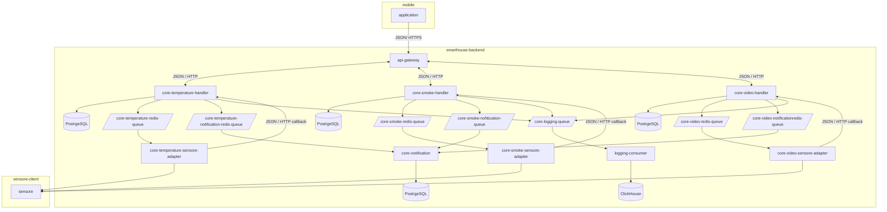

```mermaid

graph TB

subgraph smarthouse-backend

api-gateway <-- JSON / HTTP --> core-temperature-handler
core-temperature-handler --> core-temperature-PostgreSQL[(PostrgeSQL)]
core-temperature-queue[/core-temperature-redis-queue/]
core-temperature-handler --> core-temperature-queue --> core-temperature-sensore-adapter
core-temperature-sensore-adapter -- JSON / HTTP callback --> core-temperature-handler

api-gateway <-- JSON / HTTP --> core-smoke-handler
core-smoke-handler --> core-smoke-PostgreSQL[(PostrgeSQL)]
core-smoke-queue[/core-smoke-redis-queue/]
core-smoke-handler --> core-smoke-queue --> core-smoke-sensore-adapter
core-smoke-sensore-adapter -- JSON / HTTP callback--> core-smoke-handler


api-gateway <-- JSON / HTTP --> core-video-handler
core-video-handler --> core-video-PostgreSQL[(PostrgeSQL)]
core-video-queue[/core-video-redis-queue/]
core-video-handler --> core-video-queue --> core-video-sensore-adapter
core-video-sensore-adapter -- JSON / HTTP callback --> core-video-handler


core-notification --> core-notification-postgres[(PostrgeSQL)]
core-video-handler --> core-video-notification-queue[/core-video-notificationredis-queue/] --> core-notification
core-smoke-handler -->  core-smoke-nofitication-queue[/core-smoke-nofitication-queue/]
--> core-notification
core-temperature-handler --> core-temperature-notification-queue[/core-temperature-notification-redis-queue/]
--> core-notification


core-video-handler --> core-logging-queue
core-smoke-handler --> core-logging-queue
core-temperature-handler --> core-logging-queue
core-logging-queue[/core-logging-queue/] --> logging-consumer -->  core-logging-ClickHouse[(ClickHouse)]


end

subgraph mobile
application -- JSON/ HTTPS --> api-gateway
end

subgraph sensore-client

core-video-sensore-adapter --> sensore
core-smoke-sensore-adapter --> sensore
core-temperature-sensore-adapter --> sensore

end
```