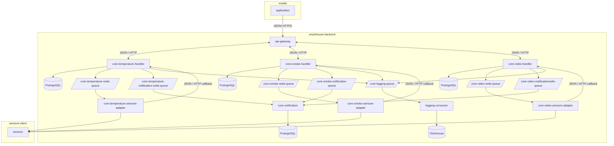

# SmartHouse Design Document

## Functional Requirements

### RU

* ___Функциональные требования безопасности системы___
    | №  | Требования                          | Приоритет  |  Трудоемкость  |
    |----|-------------------------------------|------------|----------------|
    | 1  |Система пожарной сигнализации должна  автоматически вызывать пожарных и отправлять уведомление пользователю (+ включать сигнализацию) при возгорании или задымлении в помещении (повышении температуры или уровня дыма)|    must   |    8 члвк/часов    |
    | 2  | Система должна обнаруживать и регистрировать движения в зоне видимости камер, сохраняя данные для удаленного доступа | must       |     6 члвк/часов   |
    | 3  | Система  интеграции с дверьми и окнами должна регистрировать (+ включать сигнализацию) несанкционированное проникновение и отправлять уведомление пользователю и/или вызывать полицию  | must       |     8 члвк/часов  |
    | 4  | Система должна предоставлять удаленный просмотр видео с камер наблюдения через приложение  | must       |     3 члвк/часа  |
    | 5  | Система должна предоставлять защиту от протечек с возможностью автоматического перекрытия подачи воды и уведомлением пользователя при обнаружении утечки   | must |     6 члвк/часов              |
    | 6  | Система должна предоставлять контролaь доступа с использованием персональных кодов для безопасного и удобного входа и выхода из дома | must |     6 члвк/часов  |
    | 7  | Система может предоставлять автоматическое резервное копирования и восстановление для сохранения настроек системы безопасности и важной информации в случае сбоев  | could       |     6 члвк/часов     |

## System Design

